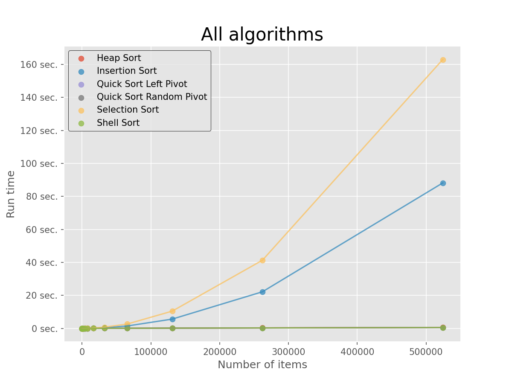
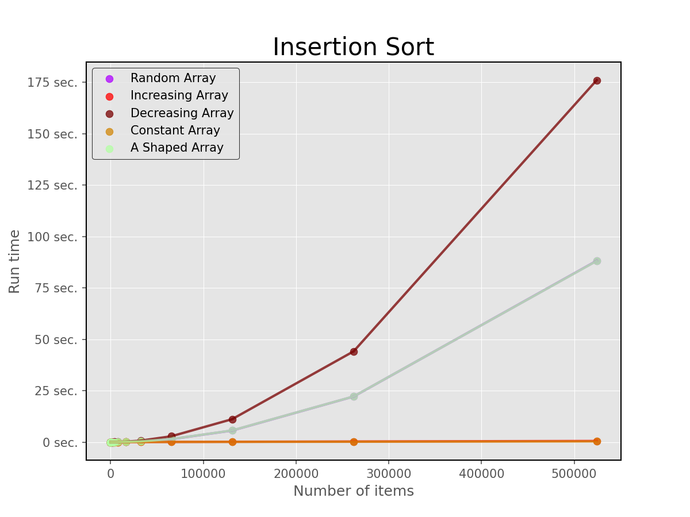
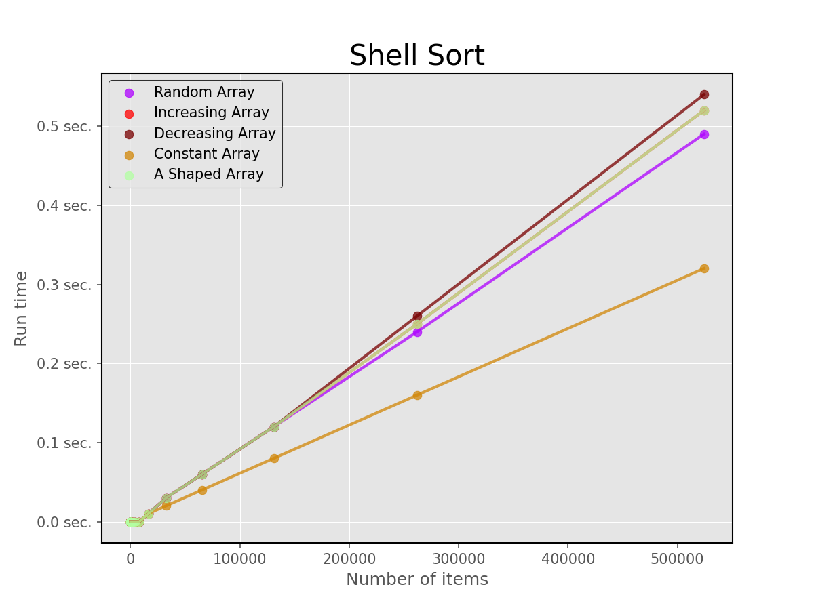
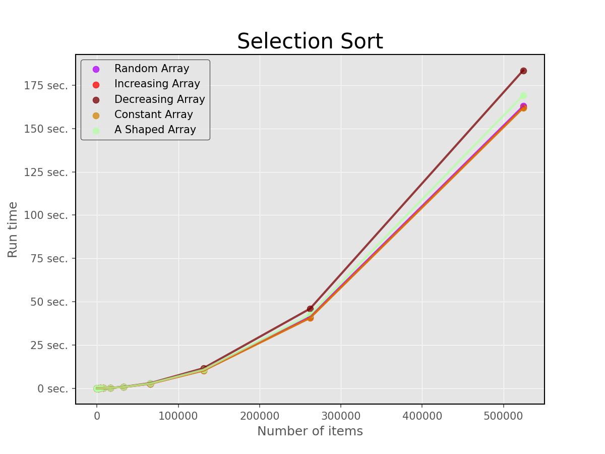
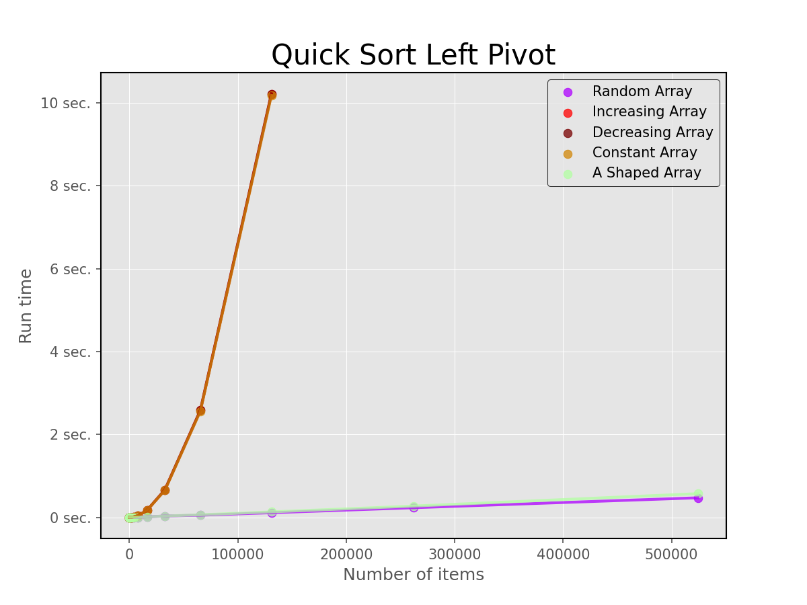
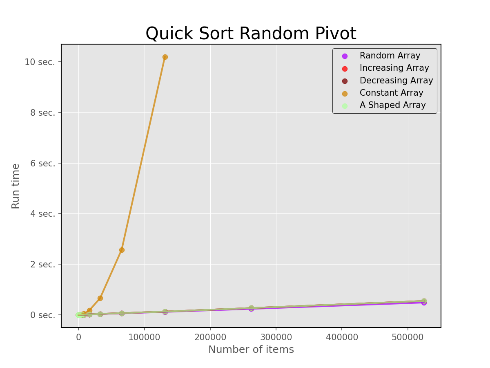
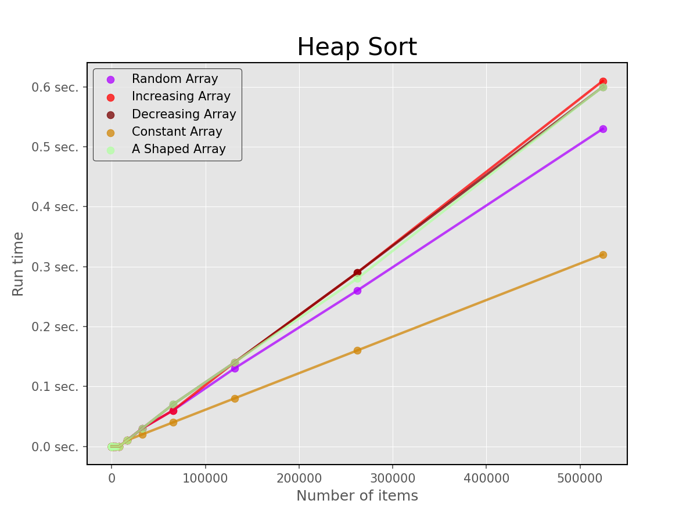

# Algorytmy sortowania

# Wstęp

Celem projektu jest implementacja oraz badanie efektywności wybranych algorytmów sortowania. Wykorzystane zostały algorytmy Insertion Sort, Shell Sort z
przyrostami Sedgewicka, Selection Sort, Merge Sort oraz Quick Sort. Algorytmy zostały
napisany w C++ a testy zostały wykonane na komputerze Apple Macbook Air z
procesorem M2.

# Zbiorcze zestawienie czasu wykonania poszczególnych algorytmów

<table style="margin-inline: auto;">
  <thead>
    <tr>
      <th>n</th>
      <th>HS t[s]</th>
      <th>IS t[s]</th>
      <th>QSLP t[s]</th>
      <th>QSRP t[s]</th>
      <th>SLS t[s]</th>
      <th>SHS t[s]</th>
    </tr>
  </thead>
  <tbody>
    <tr>
      <td>4</td>
      <td>0.00</td>
      <td>0.00</td>
      <td>0.00</td>
      <td>0.00</td>
      <td>0.00</td>
      <td>0.00</td>
    </tr>
    <tr>
      <td>8</td>
      <td>0.00</td>
      <td>0.00</td>
      <td>0.00</td>
      <td>0.00</td>
      <td>0.00</td>
      <td>0.00</td>
    </tr>
    <tr>
      <td>16</td>
      <td>0.00</td>
      <td>0.00</td>
      <td>0.00</td>
      <td>0.00</td>
      <td>0.00</td>
      <td>0.00</td>
    </tr>
    <tr>
      <td>32</td>
      <td>0.00</td>
      <td>0.00</td>
      <td>0.00</td>
      <td>0.00</td>
      <td>0.00</td>
      <td>0.00</td>
    </tr>
    <tr>
      <td>64</td>
      <td>0.00</td>
      <td>0.00</td>
      <td>0.00</td>
      <td>0.00</td>
      <td>0.00</td>
      <td>0.00</td>
    </tr>
    <tr>
      <td>128</td>
      <td>0.00</td>
      <td>0.00</td>
      <td>0.00</td>
      <td>0.00</td>
      <td>0.00</td>
      <td>0.00</td>
    </tr>
    <tr>
      <td>256</td>
      <td>0.00</td>
      <td>0.00</td>
      <td>0.00</td>
      <td>0.00</td>
      <td>0.00</td>
      <td>0.00</td>
    </tr>
    <tr>
      <td>512</td>
      <td>0.00</td>
      <td>0.00</td>
      <td>0.00</td>
      <td>0.00</td>
      <td>0.00</td>
      <td>0.00</td>
    </tr>
    <tr>
      <td>1024</td>
      <td>0.00</td>
      <td>0.00</td>
      <td>0.00</td>
      <td>0.00</td>
      <td>0.00</td>
      <td>0.00</td>
    </tr>
    <tr>
      <td>2048</td>
      <td>0.00</td>
      <td>0.00</td>
      <td>0.00</td>
      <td>0.00</td>
      <td>0.00</td>
      <td>0.00</td>
    </tr>
    <tr>
      <td>4096</td>
      <td>0.00</td>
      <td>0.01</td>
      <td>0.00</td>
      <td>0.00</td>
      <td>0.01</td>
      <td>0.00</td>
    </tr>
    <tr>
      <td>8192</td>
      <td>0.00</td>
      <td>0.02</td>
      <td>0.00</td>
      <td>0.00</td>
      <td>0.04</td>
      <td>0.00</td>
    </tr>
    <tr>
      <td>16384</td>
      <td>0.01</td>
      <td>0.09</td>
      <td>0.01</td>
      <td>0.01</td>
      <td>0.17</td>
      <td>0.01</td>
    </tr>
    <tr>
      <td>32768</td>
      <td>0.03</td>
      <td>0.36</td>
      <td>0.03</td>
      <td>0.03</td>
      <td>0.74</td>
      <td>0.03</td>
    </tr>
    <tr>
      <td>65536</td>
      <td>0.06</td>
      <td>1.41</td>
      <td>0.05</td>
      <td>0.05</td>
      <td>2.59</td>
      <td>0.06</td>
    </tr>
    <tr>
      <td>131072</td>
      <td>0.13</td>
      <td>5.59</td>
      <td>0.11</td>
      <td>0.11</td>
      <td>10.42</td>
      <td>0.12</td>
    </tr>
    <tr>
      <td>262144</td>
      <td>0.26</td>
      <td>22.14</td>
      <td>0.23</td>
      <td>0.23</td>
      <td>41.26</td>
      <td>0.24</td>
    </tr>
    <tr>
      <td>524288</td>
      <td>0.53</td>
      <td>88.14</td>
      <td>0.47</td>
      <td>0.48</td>
      <td>162.94</td>
      <td>0.49</td>
    </tr>
  </tbody>
</table>

Tabela 1: Zestawienie pomiarów czasu wykonania dla poszczególnych algorytmów. Pomiary są w sekundach. n – długość tablicy, HS – Heap Sort, IS – Insertion Sort, QSLP – Quick Sort Left Pivot, QSRP – Quick Sort Random Pivot, SLS – Selection Sort, SHS – Shell Sort

   

    

    Wykres 1: Zbiorczy wykres czasu wykonania poszczególnych algorytmów

   

    

    Wykres 2: Zbiorczy wykres czasu wykonania poszczególnych algorytmów na skali logarytmicznej.

   

# Złożoność czasowa

**Insertion Sort:** Złożoność obliczeniowa

| Minimalna | Maksymalna | Średnia  |
|:---------:|:----------:|:--------:|
| $O(n)$    | $O(n^2)$   | $O(n^2)$ |

Insertion Sort sortuje elementy poprzez iteracyjne "wstawianie" każdego elementu na odpowiednie miejsce w posortowanej już części tablicy.

    

    Wykres 3: Złożoność czasowa insertion sort

   

**Shell Sort:** Złożoność obliczeniowa

| Minimalna     | Maksymalna | Średnia              |
|:-------------:|:----------:|:--------------------:|
| $O(n\log{n})$ | $O(n^2)$   | $O(n^{\frac{4}{3}})$ |

Shell Sort jest ulepszoną wersją Insertion Sort, która dzieli listę na mniejsze podlisty, a następnie sortuje je przy użyciu Insertion Sort. 

    

    Wykres 4: Złożoność czasowa shell sort

   

**Selection Sort:** Złożoność obliczeniowa

| Minimalna | Maksymalna | Średnia  |
|:---------:|:----------:|:--------:|
| $O(n^2)$  | $O(n^2)$   | $O(n^2)$ |

Selection Sort znajduje najmniejszy element w nieposortowanej części listy i zamienia go z pierwszym nieposortowanym elementem.

    

    Wykres 5: Złożoność czasowa selection sort

   

**Quick Sort Left Pivot:** Złożoność obliczeniowa

| Minimalna     | Maksymalna | Średnia       |
|:-------------:|:----------:|:-------------:|
| $O(n\log{n})$ | $O(n^2)$   | $O(n\log{n})$ |

Quick Sort to algorytm sortowania dziel i zwyciężaj. Wybiera się element pivotowy, a następnie dzieli się listę na dwa podzbiory - mniejsze od pivota i większe od pivota. Następnie sortuje się rekurencyjnie oba podzbiory. Dla tablicy o długości 262144 oraz 524288 algorytm zwraca błąd „Command terminated by signal 11”.

    

    Wykres 6: Złożoność czasowa quick sort left pivot

   

**Quick Sort Random Pivot:** Złożoność obliczeniowa

| Minimalna     | Maksymalna | Średnia       |
|:-------------:|:----------:|:-------------:|
| $O(n\log{n})$ | $O(n^2)$   | $O(n\log{n})$ |

Ten algorytm działa tak samo jak Quick Sort z pivotem na lewo, z wyjątkiem tego, że pivot jest losowo wybierany spośród elementów listy. Dla tablicy o długości 262144 oraz 524288 algorytm zwraca błąd „Command terminated by signal 11”

    

    Wykres 7: Złożoność czasowa quick sort random pivot

   

**Heap Sort:** Złożoność obliczeniowa

| Minimalna     | Maksymalna    | Średnia       |
|:-------------:|:-------------:|:-------------:|
| $O(n\log{n})$ | $O(n\log{n})$ | $O(n\log{n})$ |

Heap Sort tworzy maksymalne drzewo kopcowe z danych, a następnie iteracyjnie usuwa największy element z korzenia kopca i przywraca kopiec do jego własności, tworząc posortowaną listę.

    

    Wykres 8: Złożoność czasowa heap sort

   
